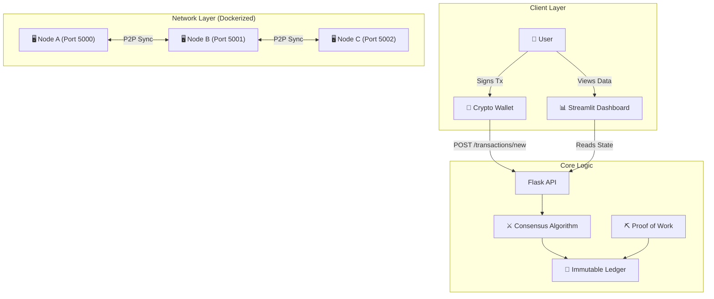
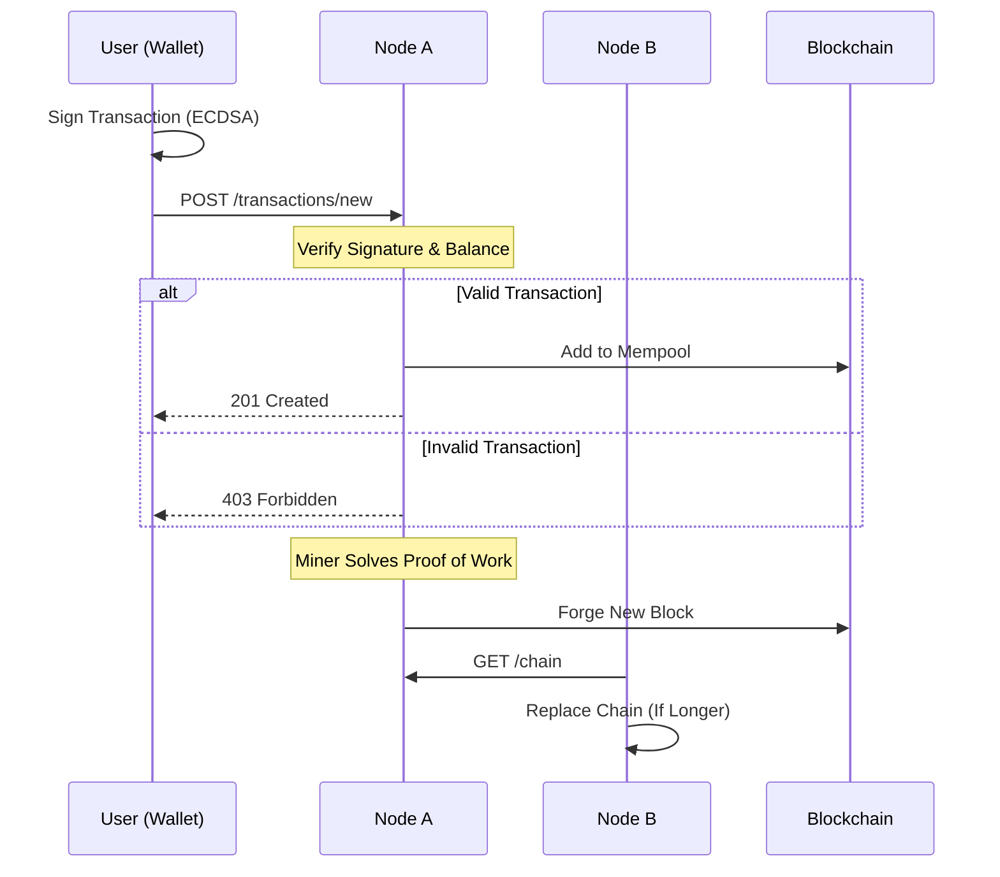

# ⛓️ PyChain: Distributed Ledger & DeFi Prototype

PyChain is a **production-grade implementation of a Blockchain data structure in Python**.  
Unlike toy scripts, this project demonstrates a **full-stack distributed system** featuring:

- Peer-to-peer networking  
- Consensus algorithms (Longest Chain Rule)  
- Cryptographic wallets & transactions  
- Real-time visualization dashboard  
- CI/CD and DevOps automation  

---

## 📸 Project Screenshots

### Streamlit Dashboard
Real-time block visualization, wallet simulation, and mining interface.


### P2P Network Simulation
Left: Node A Mining (Port 5000) | Right: Node B Syncing (Port 5001)


---

## 🏗️ System Architecture

The system is designed as a **distributed network of independent nodes**, each running a Flask API and maintaining a local copy of the ledger.



---

## 💸 Transaction Lifecycle

How a financial transaction flows from a wallet into the immutable ledger.



---

## 🚀 Key Features

### P2P Consensus Engine
Implements the **Longest Chain Rule** to resolve conflicts between distributed nodes.

### Cryptographic Security
Uses **ECDSA (SECP256k1)** for wallet generation and transaction signing (same curve as Bitcoin).

### DevOps Pipeline
Fully automated **CI/CD** using **GitHub Actions** and **Docker containerization**.

### Interactive UI
Real-time visualization of blocks, transactions, and mining operations using **Streamlit**.

---

## 🛠️ Tech Stack

| Component  | Technology     | Description                       |
|------------|----------------|-----------------------------------|
| Core Logic | Python 3.10    | SHA-256 hashing, OOP architecture |
| API        | Flask          | RESTful P2P communication         |
| Frontend   | Streamlit      | Reactive web dashboard            |
| Security   | ECDSA          | Elliptic Curve Digital Signatures |
| DevOps     | Docker         | Containerized deployment          |
| Automation | GNU Make       | Task abstraction                  |
| CI/CD      | GitHub Actions | Automated linting & unit testing  |

---

## ⚙️ Installation & Usage

### Option A: Quick Start (Docker) — **Recommended**

Run the entire stack (API + Dashboard) using Docker.

```bash
docker-compose up --build
```

**Services:**

- 📊 Dashboard: [http://localhost:8501](http://localhost:8501)
- 🔗 API Node: [http://localhost:5000](http://localhost:5000)

---

### Option B: Manual Setup (Local)

#### Prerequisites

- Python **3.10+**
- pip package manager

#### Install Dependencies

```bash
pip install -r requirements.txt
```

#### Run the Flask API

```bash
python src/api.py 5000
```

#### Launch Dashboard

```bash
streamlit run src/dashboard.py
```

---

## 🌿 Gitflow Strategy

This repository follows **strict Gitflow conventions**, showcasing feature isolation, structured merges, and release tagging.


---

## 📡 API Endpoints

| Method | Endpoint            | Description                           |
|--------|---------------------|---------------------------------------|
| GET    | `/mine`             | Calculates PoW and forges a new block |
| POST   | `/transactions/new` | Submits a signed transaction          |
| GET    | `/chain`            | Returns the full blockchain           |
| POST   | `/nodes/register`   | Registers a new node                  |
| GET    | `/nodes/resolve`    | Triggers the consensus algorithm      |

---

## 📂 Project Structure

```
.github/
    └── workflows/
        └── python-app.yml
screenshots/
    ├── dashboard.png
    └── p2p_sync.png
src/
    ├── __pycache__/
    ├── api.py
    ├── blockchain.py
    ├── dashboard.py
    └── wallet.py
tests/
    └── test_blockchain.py
.gitignore
config.py
docker-compose.yml
Dockerfile
Makefile
python-app.yml
README.md
requirements.txt
```

---

## 🧪 Testing

Run the test suite to verify core functionality:

```bash
# Run all tests
make test

# Run with coverage report
pytest --cov=src tests/
```

---

## 🤝 Contributing

Contributions are welcome! Please follow these steps:

1. Fork the repository
2. Create a feature branch
   ```bash
   git checkout -b feat/amazing-feature
   ```
3. Commit your changes
   ```bash
   git commit -m "feat: add amazing feature"
   ```
4. Push to branch
   ```bash
   git push origin feat/amazing-feature
   ```
5. Open a Pull Request

Please ensure your code passes all tests and follows the project's coding style.

---

## 📄 License

Distributed under the **MIT License**.  
See `LICENSE` for more information.

---

## 🙏 Acknowledgments

- Inspired by Satoshi Nakamoto's Bitcoin whitepaper
- Built with modern Python best practices
- Special thanks to the open-source community

---

**⭐ Star this repo if you find it useful!**
