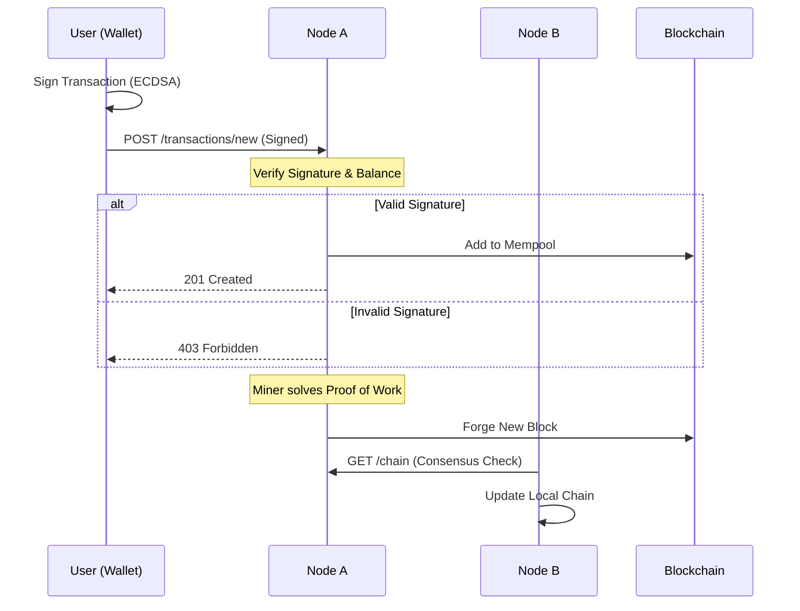
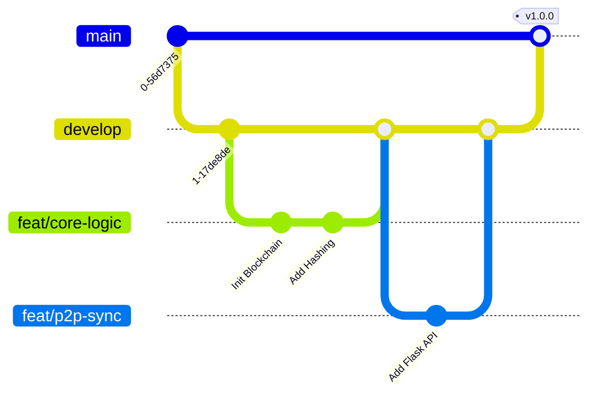

⛓️ PyChain: Distributed Ledger & DeFi Prototype

PyChain is a production-grade implementation of a Blockchain data structure in Python. Unlike simple scripts, this project demonstrates a full-stack Distributed System featuring P2P networking, Consensus Algorithms (Longest Chain), Real-time Dashboarding, and DevOps automation.

📸 Project Screenshots

**Streamlit Dashboard**

Real-time block visualization, wallet simulation, and mining interface.


**P2P Network Simulation**

Left: Node A Mining (Port 5000) | Right: Node B Syncing (Port 5001)


🏗️ System Architecture

The system is designed as a distributed network of nodes, each running a Flask API and maintaining a local copy of the ledger.

```mermaid
graph TD
    subgraph "Client Layer"
        User[👤 User]
        Dash[📊 Streamlit Dashboard]
        Wallet[🔑 Crypto Wallet]
    end

    subgraph "Network Layer (Dockerized)"
        NodeA[🖥️ Node A (Port 5000)]
        NodeB[🖥️ Node B (Port 5001)]
        NodeC[🖥️ Node C (Port 5002)]
    end

    subgraph "Core Logic"
        API[Flask API]
        Consensus[⚔️ Consensus Algo]
        PoW[⛏️ Proof of Work]
        Chain[🔗 Immutable Ledger]
    end

    User -->|Views Data| Dash
    User -->|Signs Tx| Wallet
    Wallet -->|POST /transactions/new| API
    Dash -->|Reads State| API
    
    NodeA <-->|Sync P2P| NodeB
    NodeB <-->|Sync P2P| NodeC
    
    API --> Consensus
    Consensus --> Chain
    PoW --> Chain
```


💸 Transaction Lifecycle (Sequence Diagram)

How a financial transaction moves from a user's wallet to the immutable ledger.




🚀 Key Features

P2P Consensus Engine: Implements the "Longest Chain Rule" to resolve conflicts between distributed nodes.

Cryptographic Security: Uses ECDSA (SECP256k1) for wallet generation and transaction signing (Same curve as Bitcoin).

DevOps Pipeline: Fully automated CI/CD using GitHub Actions and Docker containerization.

Interactive UI: Real-time visualization of blocks and mining operations using Streamlit.

🛠️ Tech Stack

Component

Technology

Description

Core Logic

Python 3.10

SHA-256 Hashing, OOP Architecture

API

Flask

RESTful endpoints for P2P communication

Frontend

Streamlit

Reactive Web Dashboard

Security

ECDSA

Elliptic Curve Digital Signatures

DevOps

Docker

Containerized deployment

Automation

GNU Make

Task abstraction

CI/CD

GitHub Actions

Automated Linting & Unit Testing

⚙️ Installation & Usage

Option A: Quick Start (Docker) - Recommended

Run the entire stack (Dashboard + Node) in a container.

docker-compose up --build


Dashboard: http://localhost:8501

API Node: http://localhost:5000

Option B: Manual Setup (Local)

Prerequisites: Python 3.10+

Install Dependencies:

pip install -r requirements.txt


Run Multiple Nodes (P2P Simulation):

# Terminal 1 (Node A)
make node1

# Terminal 2 (Node B)
make node2


Launch Dashboard:

make dashboard


🌿 Gitflow Strategy

This project adheres to strict Gitflow conventions. The repository history demonstrates complex branching, feature isolation, and merge conflict resolution.




📡 API Endpoints

Method

Endpoint

Description

GET

/mine

Calculates PoW and forges a new block

POST

/transactions/new

Submits a new signed transaction

GET

/chain

Returns the full blockchain data

POST

/nodes/register

Registers a new neighbor node URL

GET

/nodes/resolve

Triggers the Consensus Algorithm

🤝 Contributing

Fork the repository

Create your feature branch (git checkout -b feat/amazing-feature)

Commit your changes (git commit -m 'feat: add amazing feature')

Push to the branch (git push origin feat/amazing-feature)

Open a Pull Request

📄 License

Distributed under the MIT License. See LICENSE for more information.